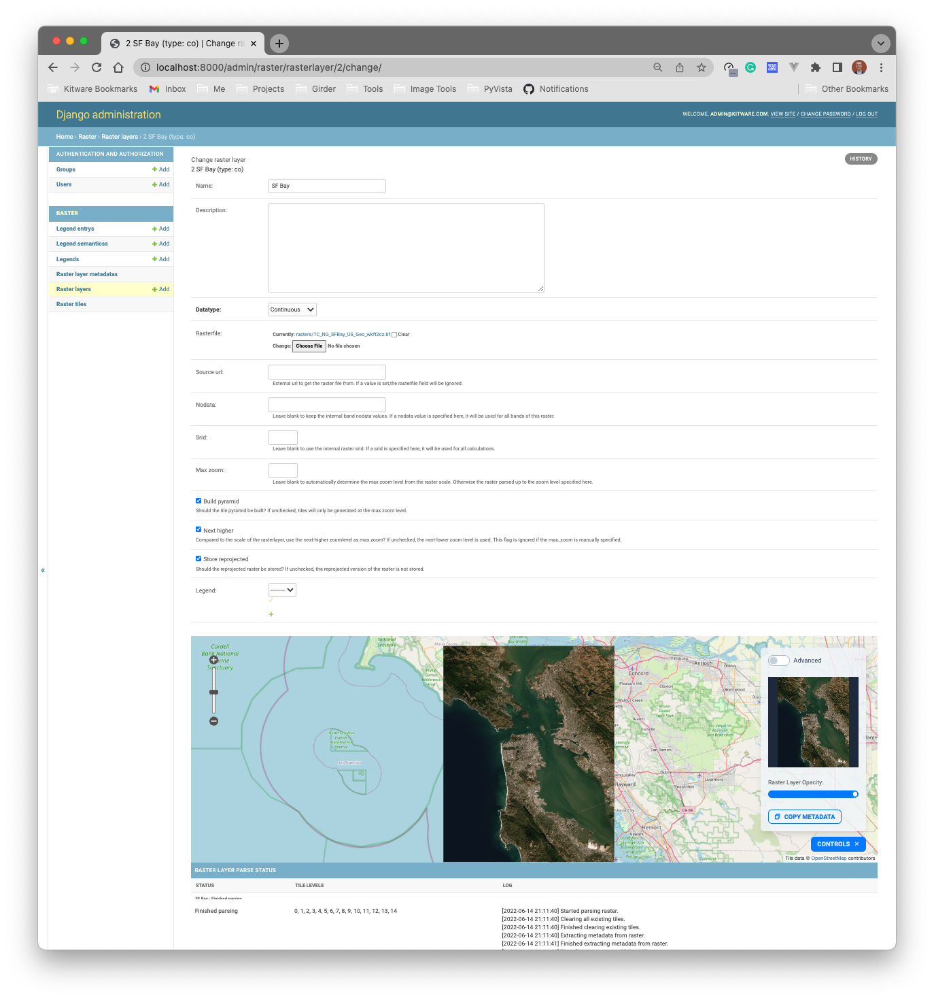

# django-raster demo

Demonstrating how to use `django-large-image` with `django-raster`




## Custom ViewSet

See `rasters/myapp/viewsets.py`

```py
from raster.models import RasterLayer
from rest_framework import mixins, serializers, viewsets

from django_large_image.rest import LargeImageDetailMixin
from django_large_image.utilities import make_vsi


def get_raster_layer_path(instance: RasterLayer):
    if instance.rasterfile:
        return instance.rasterfile.name
    if instance.source_url:
        return make_vsi(instance.source_url)


class RasterLayerSerializer(serializers.ModelSerializer):
    class Meta:
        model = RasterLayer
        fields = '__all__'


class DjangoRasterViewSet(
    mixins.ListModelMixin,
    viewsets.GenericViewSet,
    LargeImageDetailMixin,
):
    queryset = RasterLayer.objects.all()
    serializer_class = RasterLayer

    def get_path(self, request, pk=None):
        object = self.get_object()
        return get_raster_layer_path(object)

```
